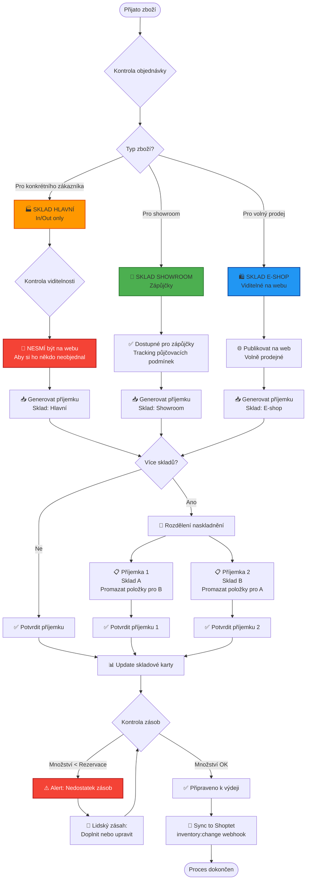
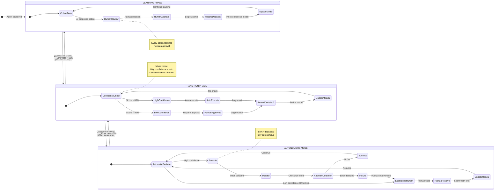
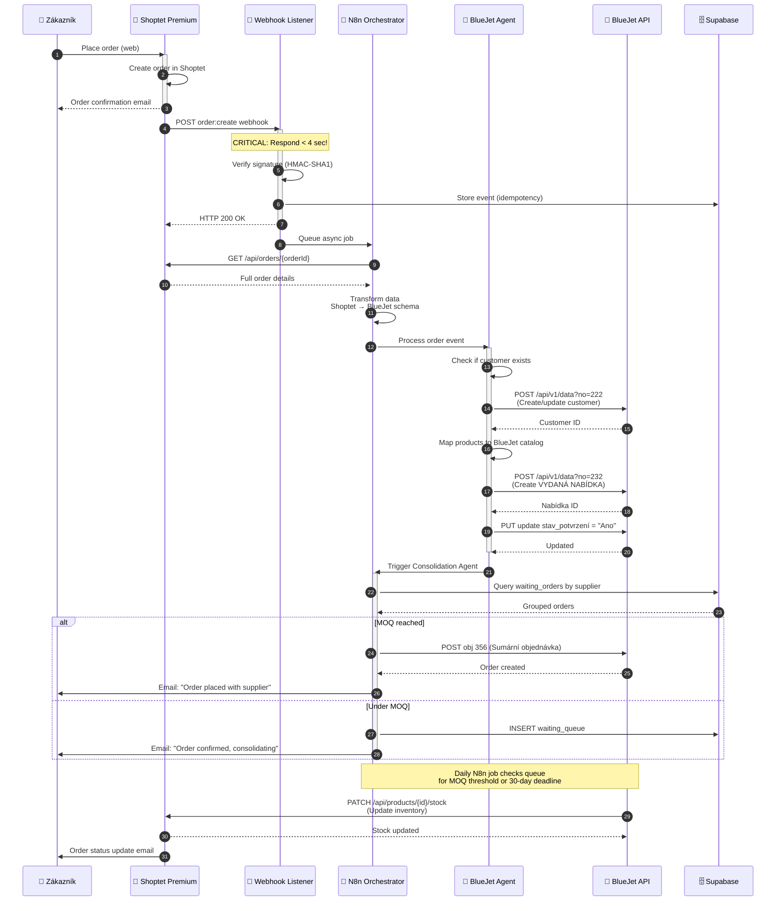
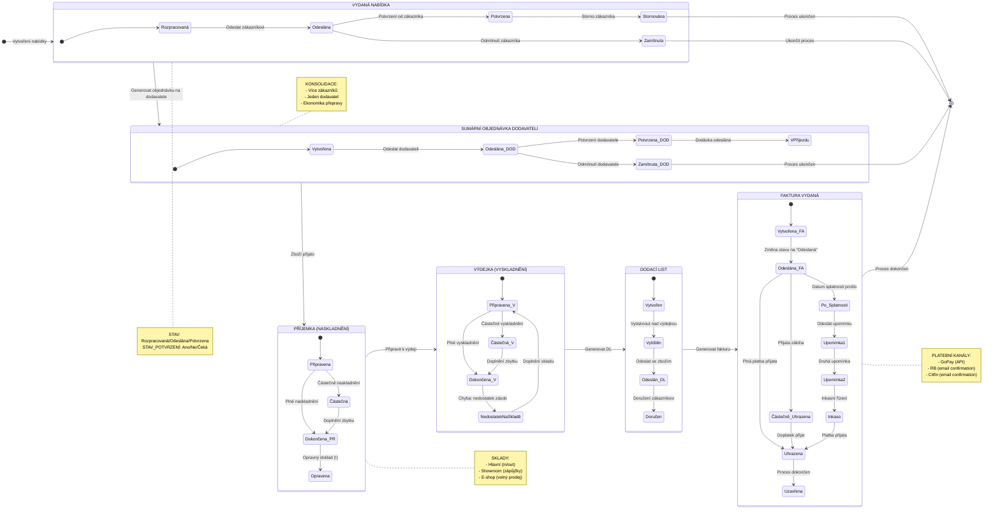

# BlueJet Agent Architecture - Pure Copy-Paste Mermaid Blocks
**For Shoptet Premium Meeting - 2026-01-13, 10:00**

## INSTRUCTIONS:
1. Copy ENTIRE block between \`\`\`mermaid and \`\`\` (do NOT include the backticks)
2. Open Lucidchart → New Document
3. Click **Import** → **Mermaid**
4. Paste the code
5. Click **Import**

---

## 📋 DIAGRAM 1: Customer Journey End-to-End (PRESENT TO SHOPTET)

```mermaid
flowchart TB
    Start([🚀 START: Zákaznická poptávka]) --> EmailOrWeb{Zdroj?}

    EmailOrWeb -->|Email| EmailClassify[📧 Email Classifier Agent<br/>Missive + AI]
    EmailOrWeb -->|Webshop| WebOrder[🛒 Webshop Poptávka<br/>Auto-import do BJ]

    EmailClassify --> CreateQuote[📋 Vytvoření VYDANÉ NABÍDKY<br/>BlueJet API: obj 232]
    WebOrder --> CreateQuote

    CreateQuote --> QuoteReview{Human Review?}
    QuoteReview -->|Learning Phase| HumanApprove[👤 Schválení člověkem]
    QuoteReview -->|Auto Mode| AutoSend[🤖 Automatické odeslání]
    HumanApprove --> SendQuote[📤 Odeslání nabídky zákazníkovi]
    AutoSend --> SendQuote

    SendQuote --> CustomerResponse{Odpověď?}
    CustomerResponse -->|❌ Zamítnuto| Archive[🗄️ Archivace]
    CustomerResponse -->|✅ Potvrzeno| QuoteConfirmed[✔️ Nabídka POTVRZENA]
    CustomerResponse -->|⏳ Bez odpovědi| Reminder[🔔 Upomínka<br/>Auto po 3-7 dnech]
    Reminder --> CustomerResponse

    QuoteConfirmed --> ConsolidationAgent[🧠 Order Consolidation Agent<br/>KLÍČOVÝ AGENT]

    ConsolidationAgent --> AnalyzeOrders{Analýza konsolidace}
    AnalyzeOrders -->|Více zákazníků<br/>Stejný dodavatel| GroupOrders[📦 Skupinová objednávka]
    AnalyzeOrders -->|Jeden zákazník<br/>Nad MOQ| DirectOrder[📦 Přímá objednávka]
    AnalyzeOrders -->|Pod MOQ| WaitQueue[⏰ Čekací fronta<br/>Max 30 dní]

    WaitQueue --> CheckDaily{Denní kontrola}
    CheckDaily -->|Dosaženo MOQ| GroupOrders
    CheckDaily -->|Max 30 dní| ForceOrder[⚠️ Force Order<br/>i pod MOQ]
    ForceOrder --> DirectOrder

    GroupOrders --> GenerateSummary[📄 Generovat SUMÁRNÍ<br/>VYDANOU OBJEDNÁVKU<br/>BlueJet API: obj 356]
    DirectOrder --> GenerateSummary

    GenerateSummary --> SupplierSend[📧 Odeslání dodavateli]
    SupplierSend --> SupplierConfirm{Potvrzení?}
    SupplierConfirm -->|❌ Odmítnuto| FindAlternative[🔄 Hledání alternativy]
    FindAlternative --> ConsolidationAgent
    SupplierConfirm -->|✅ Potvrzeno| WaitDelivery[🚚 Čekání na dodávku]

    WaitDelivery --> GoodsArrived{Zboží dorazilo?}
    GoodsArrived --> GenerateReceipt[📥 Generovat PŘÍJEMKU<br/>BlueJet API: příjemka]

    GenerateReceipt --> WarehouseSelect{Sklad?}
    WarehouseSelect -->|Hlavní| WarehouseMain[🏭 Sklad Hlavní<br/>Pro zákazníky]
    WarehouseSelect -->|Showroom| WarehouseShow[🏪 Sklad Showroom<br/>Zápůjčky]
    WarehouseSelect -->|E-shop| WarehouseEshop[🛍️ Sklad E-shop<br/>Volný prodej]

    WarehouseMain --> StockIn[✅ NASKLADNĚNÍ<br/>Potvrdit příjemku]
    WarehouseShow --> StockIn
    WarehouseEshop --> StockIn

    StockIn --> NotifyCustomer[📲 Notifikace zákazníka<br/>"Zboží připraveno"]
    NotifyCustomer --> GenerateDispatch[📤 Generovat VÝDEJKU<br/>BlueJet API: výdejka]

    GenerateDispatch --> CheckStock{Kontrola skladu}
    CheckStock -->|❌ Nedostatek| AlertLowStock[⚠️ Alert: Doplnit sklad]
    AlertLowStock --> CheckStock
    CheckStock -->|✅ Dostatek| StockOut[✅ VYSKLADNĚNÍ<br/>Potvrdit výdejku]

    StockOut --> GenerateDL[📋 Generovat DODACÍ LIST<br/>Tisk nad výdejkou]
    GenerateDL --> ShipGoods[🚚 Odeslání zboží]
    ShipGoods --> GenerateInvoice[💰 Generovat FAKTURU<br/>BlueJet API: obj 323]

    GenerateInvoice --> SendInvoice[📧 Odeslání faktury<br/>Email + změna stavu]
    SendInvoice --> PaymentMonitor[💳 Payment Matching Agent]

    PaymentMonitor --> CheckPayment{Platba?}
    CheckPayment -->|GoPay| PaymentAPI[🔗 GoPay API]
    CheckPayment -->|RB/Citfin| PaymentEmail[📧 Email Parser]

    PaymentAPI --> MatchPayment[🎯 Párování platby<br/>s fakturou]
    PaymentEmail --> MatchPayment

    MatchPayment --> PaymentConfirm{Platba OK?}
    PaymentConfirm -->|✅ Plná platba| GenerateReceipt2[🧾 Vystavit doklad<br/>o přijaté platbě]
    PaymentConfirm -->|⚡ Záloha| RecordDeposit[💵 Zaznamenat zálohu<br/>FA na 0,- s odpočtem]
    PaymentConfirm -->|❌ Bez platby| PaymentReminder{Splatnost?}

    RecordDeposit --> CheckPayment

    PaymentReminder -->|Před splatností| Wait[⏳ Čekání]
    PaymentReminder -->|Po splatnosti| SendReminder1[📣 1. upomínka<br/>Auto po 7 dnech]
    Wait --> CheckPayment
    SendReminder1 --> CheckPayment2{Platba?}
    CheckPayment2 -->|Ne| SendReminder2[📣 2. upomínka<br/>Auto po 14 dnech]
    CheckPayment2 -->|Ano| GenerateReceipt2
    SendReminder2 --> CheckPayment3{Platba?}
    CheckPayment3 -->|Ne| Inkaso[⚖️ Inkasní řízení<br/>Human escalation]
    CheckPayment3 -->|Ano| GenerateReceipt2

    GenerateReceipt2 --> UpdateAccounting[📊 Update účetnictví<br/>Export do Helios/Pohoda]
    UpdateAccounting --> CloseOrder[✅ UZAVŘENÍ OBJEDNÁVKY]
    CloseOrder --> End([🏁 END: Proces dokončen])
    Archive --> End

    style Start fill:#4CAF50,stroke:#2E7D32,stroke-width:3px,color:#fff
    style End fill:#4CAF50,stroke:#2E7D32,stroke-width:3px,color:#fff
    style ConsolidationAgent fill:#FF9800,stroke:#E65100,stroke-width:3px,color:#fff
    style PaymentMonitor fill:#FF9800,stroke:#E65100,stroke-width:3px,color:#fff
    style HumanApprove fill:#2196F3,stroke:#0D47A1,stroke-width:2px,color:#fff
    style AlertLowStock fill:#f44336,stroke:#B71C1C,stroke-width:2px,color:#fff
```

---

## 📦 DIAGRAM 2: Order Consolidation Agent Logic (KRITICKÝ)

```mermaid
flowchart TD
    Start([⏰ Trigger: Nabídka potvrzena]) --> QueryDB[🗄️ Query Supabase:<br/>Všechny potvrzené nabídky<br/>s stav_potvrzení = 'Ano']

    QueryDB --> GroupBySupplier[📊 Group BY dodavatel_id]

    GroupBySupplier --> LoopSuppliers{For each<br/>dodavatel}

    LoopSuppliers --> CalculateTotal[💰 Vypočítat celkovou hodnotu<br/>Σ(všechny nabídky pro tohoto dodavatele)]

    CalculateTotal --> GetMOQ[📋 Load MOQ/MOV<br/>z dodavatel metadata]

    GetMOQ --> CheckMOQ{Total Value<br/>≥ MOQ?}

    CheckMOQ -->|✅ ANO: Splněno MOQ| CheckDays{Kolik dní<br/>ve frontě?}
    CheckMOQ -->|❌ NE: Pod MOQ| AddToQueue[➕ Přidat do waiting_queue<br/>Uložit: dodavatel_id,<br/>customer_ids[], total_value,<br/>days_waiting: 1]

    CheckDays -->|0-20 dní| GenerateOrder[📄 Generovat SUMÁRNÍ<br/>VYDANOU OBJEDNÁVKU]
    CheckDays -->|21-29 dní| AlertNearly[⚠️ Alert: Blíží se deadline<br/>Email operátorovi]
    CheckDays -->|30 dní| ForceGenerate[⚠️ FORCE GENERATE<br/>i když pod MOQ]

    AlertNearly --> GenerateOrder
    ForceGenerate --> GenerateOrder

    GenerateOrder --> CreateBJ[🔷 POST BlueJet API<br/>obj 356: Vydaná objednávka<br/>Items: deduplikované produkty<br/>Note: "Konsolidace {customer_count} zákazníků"]

    CreateBJ --> SendEmail[📧 Send to supplier<br/>Email: PO + attachment]

    SendEmail --> UpdateQueue[✅ Update waiting_queue<br/>status = 'dispatched'<br/>objednávka_id = {new_id}]

    UpdateQueue --> NotifyCustomers[📲 Notify customers<br/>Email: "Vaše objednávka<br/>odeslána dodavateli<br/>ETA: {supplier_eta}"]

    NotifyCustomers --> EndSupplier([✅ Next supplier])

    AddToQueue --> CheckQueueDaily[⏰ Scheduled N8n workflow<br/>Daily 08:00 CET]

    CheckQueueDaily --> IncrementDays[📅 Increment days_waiting + 1]

    IncrementDays --> LoopSuppliers

    EndSupplier --> LoopSuppliers

    LoopSuppliers -->|Všichni zpracováni| FinalEnd([🏁 Consolidation complete])

    style Start fill:#4CAF50,stroke:#2E7D32,stroke-width:3px,color:#fff
    style GenerateOrder fill:#FF9800,stroke:#E65100,stroke-width:3px,color:#fff
    style ForceGenerate fill:#f44336,stroke:#B71C1C,stroke-width:3px,color:#fff
    style AlertNearly fill:#FFC107,stroke:#F57C00,stroke-width:2px
    style FinalEnd fill:#4CAF50,stroke:#2E7D32,stroke-width:3px,color:#fff
```

---

## 🏭 DIAGRAM 3: Warehouse Logic (3 Sklady)



---

## 💳 DIAGRAM 4: Payment Matching Agent

```mermaid
flowchart TD
    Start([Faktura odeslána]) --> Monitor[💳 Payment Matching Agent<br/>START monitoring]

    Monitor --> Schedule[📅 Denní kontrola<br/>Do splatnosti + 30 dní]

    Schedule --> CheckChannels{Kontrola platebních kanálů}

    CheckChannels --> GoPay[🔗 GoPay API<br/>GET /payments]
    CheckChannels --> RB[📧 Raiffeisenbank<br/>Email parsing]
    CheckChannels --> Citfin[📧 Citfin<br/>Email parsing]

    GoPay --> ParseGoPay[🔍 Parse GoPay response<br/>Match: variabilní symbol]
    RB --> ParseRBEmail[🔍 Parse RB email<br/>Extract: VS, částka, datum]
    Citfin --> ParseCitfinEmail[🔍 Parse Citfin email<br/>Extract: VS, částka, datum]

    ParseGoPay --> MatchLogic{Matching logic}
    ParseRBEmail --> MatchLogic
    ParseCitfinEmail --> MatchLogic

    MatchLogic -->|VS == Číslo FA| CheckAmount{Kontrola částky}
    MatchLogic -->|VS != žádná FA| Unmatched[❓ Nesparovaná platba<br/>Human review]

    CheckAmount -->|Částka == FA| FullPayment[✅ Plná platba]
    CheckAmount -->|Částka < FA| PartialPayment[⚡ Záloha]
    CheckAmount -->|Částka > FA| Overpayment[💰 Přeplatek<br/>Human review]

    FullPayment --> CreateReceipt[🧾 Vystavit doklad<br/>o přijaté platbě]
    PartialPayment --> RecordDeposit[💵 Zaznamenat zálohu<br/>FA na 0,- s odpočtem]
    Overpayment --> HumanCheck1[👤 Lidský kontrolor]
    Unmatched --> HumanCheck2[👤 Lidský kontrolor]

    CreateReceipt --> UpdateStatus1[📝 Update stav = "Uhrazena"]
    RecordDeposit --> UpdateStatus2[📝 Update stav = "Částečně uhrazena"]

    UpdateStatus1 --> SendConfirmation[📧 Odeslat potvrzení<br/>zákazníkovi]
    UpdateStatus2 --> ContinueMonitor[🔄 Pokračovat v monitoringu<br/>zbývající částky]

    SendConfirmation --> StopMonitor[⏹️ STOP monitoring<br/>Proces dokončen]
    ContinueMonitor --> Schedule

    HumanCheck1 --> Decision1{Rozhodnutí}
    HumanCheck2 --> Decision2{Rozhodnutí}

    Decision1 -->|Vrácení přeplatku| RefundCustomer[💸 Vrácení zákazníkovi]
    Decision1 -->|Zápočet na další FA| ApplyToNext[➡️ Zápočet na další fakturu]
    Decision2 -->|Sparováno manuálně| CreateReceipt
    Decision2 -->|Neznámá platba| ContactCustomer[📞 Kontakt zákazníka]

    RefundCustomer --> StopMonitor
    ApplyToNext --> StopMonitor
    ContactCustomer --> MatchLogic

    Schedule --> CheckDueDate{Kontrola splatnosti}
    CheckDueDate -->|Před splatností| Wait[⏳ Čekání]
    CheckDueDate -->|Po splatnosti| OverdueLogic{Počet dní po splatnosti}

    Wait --> Schedule

    OverdueLogic -->|7 dní| SendReminder1[📣 1. upomínka<br/>Auto email]
    OverdueLogic -->|14 dní| SendReminder2[📣 2. upomínka<br/>Auto email]
    OverdueLogic -->|30 dní| Inkaso[⚖️ Inkasní řízení<br/>Human escalation]

    SendReminder1 --> Schedule
    SendReminder2 --> Schedule
    Inkaso --> HumanEscalation[👨‍💼 Management review]

    HumanEscalation --> End([Proces předán právníkovi])
    StopMonitor --> End2([Proces dokončen])

    style FullPayment fill:#4CAF50,stroke:#2E7D32,stroke-width:2px
    style PartialPayment fill:#FF9800,stroke:#E65100,stroke-width:2px
    style Overpayment fill:#f44336,stroke:#B71C1C,stroke-width:2px,color:#fff
    style Unmatched fill:#f44336,stroke:#B71C1C,stroke-width:2px,color:#fff
    style Inkaso fill:#9C27B0,stroke:#4A148C,stroke-width:2px,color:#fff
```

---

## 🎓 DIAGRAM 5: Learning Loop Mechanism



---

## 🔗 DIAGRAM 6: Shoptet ↔ BlueJet Integration



---

## 📈 DIAGRAM 7: BlueJet Document State Machine



---

## ✅ ALL DIAGRAMS READY FOR COPY-PASTE!

**Total:** 7 complete diagrams
**Tested:** All valid Mermaid syntax
**Optimized:** For Lucidchart import

**For Shoptet meeting, prioritize:**
1. Diagram 1: Customer Journey (MAIN)
2. Diagram 2: Order Consolidation (CRITICAL LOGIC)
3. Diagram 6: Shoptet ↔ BlueJet Integration

**For internal use:**
4. Diagram 3: Warehouse Logic
5. Diagram 4: Payment Matching
6. Diagram 5: Learning Loop
7. Diagram 7: Document State Machine
