# BlueJet Agent Architecture - Mermaid Diagrams

## 1. DOCUMENT STATE MACHINE (Stavy Dokumentů)
**Pro vyplnění událostí měnících "stav" a "stav potvrzení"**

```mermaid
stateDiagram-v2
    direction LR

    [*] --> NováNabídka: Vytvoření nabídky

    state "VYDANÁ NABÍDKA" as NováNabídka {
        [*] --> Rozpracovaná
        Rozpracovaná --> Odeslána: Odeslat zákazníkovi
        Odeslána --> Potvrzena: Potvrzení od zákazníka
        Odeslána --> Zamítnuta: Odmítnutí zákazníka
        Potvrzena --> Stornována: Storno zákazníka
    }

    NováNabídka --> SumárníObjednávka: Generovat objednávku na dodavatele
    Zamítnuta --> [*]: Ukončit proces

    state "SUMÁRNÍ OBJEDNÁVKA DODAVATELI" as SumárníObjednávka {
        [*] --> Vytvořena
        Vytvořena --> Odeslána_DOD: Odeslat dodavateli
        Odeslána_DOD --> Potvrzena_DOD: Potvrzení dodavatele
        Potvrzena_DOD --> VPříjezdu: Dodávka odeslána
        Odeslána_DOD --> Zamítnuta_DOD: Odmítnutí dodavatele
    }

    SumárníObjednávka --> Příjemka: Zboží přijato

    state "PŘÍJEMKA (NASKLADNĚNÍ)" as Příjemka {
        [*] --> Připravena
        Připravena --> Částečná: Částečné naskladnění
        Připravena --> Dokončena_PR: Plné naskladnění
        Částečná --> Dokončena_PR: Doplnění zbytku
        Dokončena_PR --> Opravena: Opravný doklad (!)
    }

    Příjemka --> Výdejka: Připravit k výdeji

    state "VÝDEJKA (VYSKLADNĚNÍ)" as Výdejka {
        [*] --> Připravena_V
        Připravena_V --> Částečná_V: Částečné vyskladnění
        Připravena_V --> Dokončena_V: Plné vyskladnění
        Částečná_V --> Dokončena_V: Doplnění zbytku
        Dokončena_V --> NedostatekNaSkladě: Chyba: nedostatek zásob
        NedostatekNaSkladě --> Připravena_V: Doplnění skladu
    }

    Výdejka --> DodacíList: Generovat DL

    state "DODACÍ LIST" as DodacíList {
        [*] --> Vytvořen
        Vytvořen --> Vytištěn: Vytisknout nad výdejkou
        Vytištěn --> Odeslán_DL: Odeslat se zbožím
        Odeslán_DL --> Doručen: Doručení zákazníkovi
    }

    DodacíList --> Faktura: Generovat fakturu

    state "FAKTURA VYDANÁ" as Faktura {
        [*] --> Vytvořena_FA
        Vytvořena_FA --> Odeslána_FA: Změna stavu na "Odeslaná"
        Odeslána_FA --> Částečně_Uhrazena: Přijata záloha
        Odeslána_FA --> Uhrazena: Plná platba přijata
        Částečně_Uhrazena --> Uhrazena: Doplatek přijat
        Uhrazena --> Uzavřena: Proces dokončen
        Odeslána_FA --> Po_Splatnosti: Datum splatnosti prošlo
        Po_Splatnosti --> Upomínka1: Odeslat upomínku
        Upomínka1 --> Upomínka2: Druhá upomínka
        Upomínka2 --> Inkaso: Inkasní řízení
        Inkaso --> Uhrazena: Platba přijata
    }

    Faktura --> [*]: Proces dokončen
    Stornována --> [*]: Proces ukončen
    Zamítnuta_DOD --> [*]: Proces ukončen

    note right of NováNabídka
        STAV: Rozpracovaná/Odeslána/Potvrzena
        STAV_POTVRZENÍ: Ano/Ne/Čeká
    end note

    note right of SumárníObjednávka
        KONSOLIDACE:
        - Více zákazníků
        - Jeden dodavatel
        - Ekonomika přepravy
    end note

    note right of Příjemka
        SKLADY:
        - Hlavní (in/out)
        - Showroom (zápůjčky)
        - E-shop (volný prodej)
    end note

    note right of Faktura
        PLATEBNÍ KANÁLY:
        - GoPay (API)
        - RB (email confirmation)
        - Citfin (email confirmation)
    end note
```



---

## 2. BUSINESS PROCESS FLOWCHART (Celý Workflow)

```mermaid
flowchart TB
    Start([🚀 START: Zákaznická poptávka]) --> EmailOrWeb{Zdroj?}

    EmailOrWeb -->|Email| EmailClassify[📧 Email Classifier Agent<br/>Missive + AI]
    EmailOrWeb -->|Webshop| WebOrder[🛒 Webshop Poptávka<br/>Auto-import do BJ]

    EmailClassify --> CreateQuote[📋 Vytvoření VYDANÉ NABÍDKY<br/>BlueJet API: obj 232]
    WebOrder --> CreateQuote

    CreateQuote --> QuoteReview{Human Review?}
    QuoteReview -->|Learning Phase| HumanApprove[👤 Schválení člověkem]
    QuoteReview -->|Auto Mode| AutoSend[🤖 Automatické odeslání]
    HumanApprove --> SendQuote[📤 Odeslání nabídky zákazníkovi]
    AutoSend --> SendQuote

    SendQuote --> CustomerResponse{Odpověď?}
    CustomerResponse -->|❌ Zamítnuto| Archive[🗄️ Archivace]
    CustomerResponse -->|✅ Potvrzeno| QuoteConfirmed[✔️ Nabídka POTVRZENA]
    CustomerResponse -->|⏳ Bez odpovědi| Reminder[🔔 Upomínka<br/>Auto po 3-7 dnech]
    Reminder --> CustomerResponse

    QuoteConfirmed --> ConsolidationAgent[🧠 Order Consolidation Agent<br/>KLÍČOVÝ AGENT]

    ConsolidationAgent --> AnalyzeOrders{Analýza konsolidace}
    AnalyzeOrders -->|Více zákazníků<br/>Stejný dodavatel| GroupOrders[📦 Skupinová objednávka]
    AnalyzeOrders -->|Jeden zákazník<br/>Nad MOQ| DirectOrder[📦 Přímá objednávka]
    AnalyzeOrders -->|Pod MOQ| WaitQueue[⏰ Čekací fronta<br/>Max 30 dní]

    WaitQueue --> CheckDaily{Denní kontrola}
    CheckDaily -->|Dosaženo MOQ| GroupOrders
    CheckDaily -->|Max 30 dní| ForceOrder[⚠️ Force Order<br/>i pod MOQ]
    ForceOrder --> DirectOrder

    GroupOrders --> GenerateSummary[📄 Generovat SUMÁRNÍ<br/>VYDANOU OBJEDNÁVKU<br/>BlueJet API: obj 356]
    DirectOrder --> GenerateSummary

    GenerateSummary --> SupplierSend[📧 Odeslání dodavateli]
    SupplierSend --> SupplierConfirm{Potvrzení?}
    SupplierConfirm -->|❌ Odmítnuto| FindAlternative[🔄 Hledání alternativy]
    FindAlternative --> ConsolidationAgent
    SupplierConfirm -->|✅ Potvrzeno| WaitDelivery[🚚 Čekání na dodávku]

    WaitDelivery --> GoodsArrived{Zboží dorazilo?}
    GoodsArrived --> GenerateReceipt[📥 Generovat PŘÍJEMKU<br/>BlueJet API: příjemka]

    GenerateReceipt --> WarehouseSelect{Sklad?}
    WarehouseSelect -->|Hlavní| WarehouseMain[🏭 Sklad Hlavní<br/>Pro zákazníky]
    WarehouseSelect -->|Showroom| WarehouseShow[🏪 Sklad Showroom<br/>Zápůjčky]
    WarehouseSelect -->|E-shop| WarehouseEshop[🛍️ Sklad E-shop<br/>Volný prodej]

    WarehouseMain --> StockIn[✅ NASKLADNĚNÍ<br/>Potvrdit příjemku]
    WarehouseShow --> StockIn
    WarehouseEshop --> StockIn

    StockIn --> NotifyCustomer[📲 Notifikace zákazníka<br/>"Zboží připraveno"]
    NotifyCustomer --> GenerateDispatch[📤 Generovat VÝDEJKU<br/>BlueJet API: výdejka]

    GenerateDispatch --> CheckStock{Kontrola skladu}
    CheckStock -->|❌ Nedostatek| AlertLowStock[⚠️ Alert: Doplnit sklad]
    AlertLowStock --> CheckStock
    CheckStock -->|✅ Dostatek| StockOut[✅ VYSKLADNĚNÍ<br/>Potvrdit výdejku]

    StockOut --> GenerateDL[📋 Generovat DODACÍ LIST<br/>Tisk nad výdejkou]
    GenerateDL --> ShipGoods[🚚 Odeslání zboží]
    ShipGoods --> GenerateInvoice[💰 Generovat FAKTURU<br/>BlueJet API: obj 323]

    GenerateInvoice --> SendInvoice[📧 Odeslání faktury<br/>Email + změna stavu]
    SendInvoice --> PaymentMonitor[💳 Payment Matching Agent]

    PaymentMonitor --> CheckPayment{Platba?}
    CheckPayment -->|GoPay| PaymentAPI[🔗 GoPay API]
    CheckPayment -->|RB/Citfin| PaymentEmail[📧 Email Parser]

    PaymentAPI --> MatchPayment[🎯 Párování platby<br/>s fakturou]
    PaymentEmail --> MatchPayment

    MatchPayment --> PaymentConfirm{Platba OK?}
    PaymentConfirm -->|✅ Plná platba| GenerateReceipt2[🧾 Vystavit doklad<br/>o přijaté platbě]
    PaymentConfirm -->|⚡ Záloha| RecordDeposit[💵 Zaznamenat zálohu<br/>FA na 0,- s odpočtem]
    PaymentConfirm -->|❌ Bez platby| PaymentReminder{Splatnost?}

    RecordDeposit --> CheckPayment

    PaymentReminder -->|Před splatností| Wait[⏳ Čekání]
    PaymentReminder -->|Po splatnosti| SendReminder1[📣 1. upomínka<br/>Auto po 7 dnech]
    Wait --> CheckPayment
    SendReminder1 --> CheckPayment2{Platba?}
    CheckPayment2 -->|Ne| SendReminder2[📣 2. upomínka<br/>Auto po 14 dnech]
    CheckPayment2 -->|Ano| GenerateReceipt2
    SendReminder2 --> CheckPayment3{Platba?}
    CheckPayment3 -->|Ne| Inkaso[⚖️ Inkasní řízení<br/>Human escalation]
    CheckPayment3 -->|Ano| GenerateReceipt2

    GenerateReceipt2 --> UpdateAccounting[📊 Update účetnictví<br/>Export do Helios/Pohoda]
    UpdateAccounting --> CloseOrder[✅ UZAVŘENÍ OBJEDNÁVKY]
    CloseOrder --> End([🏁 END: Proces dokončen])
    Archive --> End

    style Start fill:#4CAF50,stroke:#2E7D32,stroke-width:3px,color:#fff
    style End fill:#4CAF50,stroke:#2E7D32,stroke-width:3px,color:#fff
    style ConsolidationAgent fill:#FF9800,stroke:#E65100,stroke-width:3px,color:#fff
    style PaymentMonitor fill:#FF9800,stroke:#E65100,stroke-width:3px,color:#fff
    style HumanApprove fill:#2196F3,stroke:#0D47A1,stroke-width:2px,color:#fff
    style AlertLowStock fill:#f44336,stroke:#B71C1C,stroke-width:2px,color:#fff
```

---

## 3. AGENT NETWORK SEQUENCE DIAGRAM (Interakce mezi agenty)

```mermaid
sequenceDiagram
    autonumber

    actor Customer as 👤 Zákazník
    participant Email as 📧 Email/Web
    participant Classifier as 🤖 Email Classifier
    participant Missive as 💬 Missive Hub
    participant QuoteAgent as 📋 Quote Agent
    participant BlueJet as 🔷 BlueJet API
    participant ConsolidAgent as 🧠 Consolidation Agent
    participant Supabase as 🗄️ Supabase
    participant SupplierAgent as 🏭 Supplier Agent
    participant DocAgent as 📄 Document Agent
    participant PaymentAgent as 💳 Payment Agent
    participant Human as 👨‍💼 Human Operator

    Customer->>Email: Odeslání poptávky
    Email->>Classifier: Nový email přijat
    activate Classifier
    Classifier->>Classifier: AI klasifikace<br/>(urgency, VIP, type)
    Classifier->>Missive: Routed conversation
    deactivate Classifier

    Missive->>QuoteAgent: Trigger: Nová poptávka
    activate QuoteAgent
    QuoteAgent->>BlueJet: GET /api/v1/data (obj 217)<br/>Vyhledat produkty
    BlueJet-->>QuoteAgent: Seznam produktů + ceny
    QuoteAgent->>BlueJet: GET /api/v1/data (obj 250)<br/>Vyhledat ceníky
    BlueJet-->>QuoteAgent: Ceníkové ceny
    QuoteAgent->>QuoteAgent: Výpočet slevy<br/>+ objemové zvýhodnění
    QuoteAgent->>BlueJet: POST /api/v1/data (obj 232)<br/>Vytvořit vydanou nabídku
    BlueJet-->>QuoteAgent: Nabídka vytvořena (ID)

    alt Learning Phase (human-in-the-loop)
        QuoteAgent->>Human: Náhled nabídky<br/>+ zdůvodnění ceny
        Human-->>QuoteAgent: Schváleno / Opraveno
    else Auto Mode
        QuoteAgent->>QuoteAgent: Auto-approve<br/>(naučená pravidla)
    end

    QuoteAgent->>Customer: 📧 Odeslání nabídky
    deactivate QuoteAgent

    Customer->>Email: ✅ Potvrzení objednávky
    Email->>Classifier: Email s potvrzením
    activate Classifier
    Classifier->>BlueJet: PUT /api/v1/data<br/>Update stav = "Potvrzena"
    deactivate Classifier

    BlueJet->>ConsolidAgent: Webhook: Nabídka potvrzena
    activate ConsolidAgent
    ConsolidAgent->>Supabase: Query: Čekající objednávky<br/>GROUP BY dodavatel
    Supabase-->>ConsolidAgent: Seznam objednávek
    ConsolidAgent->>ConsolidAgent: Analýza konsolidace<br/>(MOQ, deadline, ekonomika)

    alt Dosaženo MOQ
        ConsolidAgent->>BlueJet: POST /api/v1/data (obj 356)<br/>Sumární vydaná objednávka
        BlueJet-->>ConsolidAgent: Objednávka vytvořena
    else Pod MOQ
        ConsolidAgent->>Supabase: INSERT waiting_queue<br/>(max_wait: 30 dní)
        ConsolidAgent->>ConsolidAgent: Schedule: Denní kontrola
    end

    ConsolidAgent->>SupplierAgent: Odeslat objednávku dodavateli
    deactivate ConsolidAgent

    activate SupplierAgent
    SupplierAgent->>Email: 📧 Email dodavateli
    deactivate SupplierAgent

    Email->>Classifier: Potvrzení od dodavatele
    activate Classifier
    Classifier->>BlueJet: PUT /api/v1/data<br/>Update stav = "Potvrzena"
    Classifier->>Supabase: Log: Estimated delivery date
    deactivate Classifier

    Note over SupplierAgent,DocAgent: ⏳ Čekání na dodávku (7-30 dní)

    SupplierAgent->>DocAgent: Zboží dorazilo
    activate DocAgent
    DocAgent->>BlueJet: POST Generování → Příjemka
    BlueJet-->>DocAgent: Příjemka vytvořena
    DocAgent->>BlueJet: POST Potvrdit příjemku<br/>(Naskladnění)
    BlueJet-->>DocAgent: Stav: Naskladněno
    DocAgent->>Customer: 📲 Notifikace: Zboží připraveno
    DocAgent->>BlueJet: POST Generování → Výdejka
    BlueJet-->>DocAgent: Výdejka vytvořena

    alt Nedostatek na skladě
        DocAgent->>DocAgent: ❌ Chyba: Množství < 0
        DocAgent->>Human: ⚠️ Alert: Doplnit sklad
        Human-->>DocAgent: Sklad doplněn
    end

    DocAgent->>BlueJet: POST Potvrdit výdejku<br/>(Vyskladnění)
    BlueJet-->>DocAgent: Stav: Vyskladněno
    DocAgent->>BlueJet: POST Generování → Dodací list
    BlueJet-->>DocAgent: DL vytvořen
    DocAgent->>BlueJet: POST Generování → Faktura
    BlueJet-->>DocAgent: Faktura vytvořena (ID)
    DocAgent->>Customer: 📧 Odeslání faktury + DL
    deactivate DocAgent

    DocAgent->>PaymentAgent: Monitor platbu pro FA_ID
    activate PaymentAgent

    loop Každý den do splatnosti + 30 dní
        PaymentAgent->>PaymentAgent: Check GoPay API
        PaymentAgent->>Email: Check RB/Citfin emails

        alt Platba přijata
            PaymentAgent->>BlueJet: POST Doklad o přijaté platbě
            BlueJet-->>PaymentAgent: Doklad vytvořen
            PaymentAgent->>BlueJet: PUT Update stav = "Uhrazena"
            PaymentAgent->>Customer: 📧 Potvrzení platby
            PaymentAgent->>PaymentAgent: ✅ Stop monitoring
        else Po splatnosti
            PaymentAgent->>Customer: 📣 Upomínka (1., 2., inkaso)
        end
    end
    deactivate PaymentAgent

    BlueJet->>Human: 📊 Export do účetnictví<br/>(Helios/Pohoda)
    Human->>BlueJet: Uzavření objednávky
```



---

## 4. ENTITY RELATIONSHIP DIAGRAM (BlueJet Data Model)

```mermaid
erDiagram
    ZAKAZNIK ||--o{ VYDANA_NABIDKA : "obdrží"
    VYDANA_NABIDKA ||--o{ VYDANA_OBJEDNAVKA_DODAVATELI : "generuje"
    VYDANA_OBJEDNAVKA_DODAVATELI ||--o{ PRIJEMKA : "vyvolá"
    VYDANA_NABIDKA ||--|| VYDEJKA : "generuje"
    VYDEJKA ||--|| DODACI_LIST : "má"
    VYDANA_NABIDKA ||--|| FAKTURA : "generuje"

    CENIK ||--o{ CENIK_POLOZKY : "obsahuje"
    CENIK_POLOZKY }o--|| PRODUKT : "odkazuje"
    PRODUKT ||--o{ VYDANA_NABIDKA : "je v"
    PRODUKT ||--o{ SKLADOVA_KARTA : "má"

    SKLAD ||--o{ SKLADOVA_KARTA : "eviduje"
    SKLADOVA_KARTA ||--o{ PRIJEMKA : "naskladnění"
    SKLADOVA_KARTA ||--o{ VYDEJKA : "vyskladnění"

    DODAVATEL ||--o{ VYDANA_OBJEDNAVKA_DODAVATELI : "přijímá"
    DODAVATEL ||--o{ CENIK : "poskytuje"

    FAKTURA }o--|| PLATBA : "má"
    PLATBA }o--|| PLATEBNI_KANAL : "přes"

    ZAKAZNIK {
        int id PK
        string nazev
        string email
        bool vip
        string segment
    }

    VYDANA_NABIDKA {
        int id PK
        int zakaznik_id FK
        string stav
        string stav_potvrzeni
        date datum_vytvoreni
        decimal celkova_cena
        int cenik_id FK
    }

    VYDANA_OBJEDNAVKA_DODAVATELI {
        int id PK
        int dodavatel_id FK
        string stav
        date datum_objednavky
        date odhadovane_doruceni
        bool konsolidovana
    }

    PRIJEMKA {
        int id PK
        int objednavka_id FK
        int sklad_id FK
        string pohyb
        date datum_prijmu
        bool potvrzena
    }

    VYDEJKA {
        int id PK
        int nabidka_id FK
        int sklad_id FK
        date datum_vydeje
        bool potvrzena
        decimal mnozstvi_na_podkarte
    }

    DODACI_LIST {
        int id PK
        int vydejka_id FK
        date datum_tisku
        bool odeslan
    }

    FAKTURA {
        int id PK
        int nabidka_id FK
        string cislo_faktury
        date datum_vystaveni
        date datum_splatnosti
        string stav
        decimal castka
        decimal castka_uhrazena
    }

    PRODUKT {
        int id PK
        string kod
        string nazev
        decimal prodejni_cena
        decimal nakupni_cena
        int dodavatel_id FK
    }

    SKLADOVA_KARTA {
        int id PK
        int produkt_id FK
        int sklad_id FK
        decimal mnozstvi
        decimal rezervovano
    }

    SKLAD {
        int id PK
        string nazev
        string typ
    }

    CENIK {
        int id PK
        string typ
        date platnost_od
        date platnost_do
        bool vzorovy
        bool akcni
        int dodavatel_id FK
    }

    CENIK_POLOZKY {
        int id PK
        int cenik_id FK
        int produkt_id FK
        decimal cena
    }

    DODAVATEL {
        int id PK
        string nazev
        decimal moq
        int dodaci_lhuta_dny
    }

    PLATBA {
        int id PK
        int faktura_id FK
        decimal castka
        date datum_platby
        int kanal_id FK
        bool sparovana
    }

    PLATEBNI_KANAL {
        int id PK
        string nazev
        string typ
    }
```



---

## 5. AGENT ARCHITECTURE - C4 CONTEXT DIAGRAM

```mermaid
C4Context
    title BlueJet Multi-Agent System - Context Diagram

    Person(customer, "Zákazník", "B2B klient objednávající gastro vybavení")
    Person(operator, "Operátor", "Lidský kontrolor v learning phase")

    System_Boundary(bluejet_system, "BlueJet Agent Network") {
        System(email_classifier, "Email Classifier Agent", "Třídí příchozí emaily, detekuje urgenci a VIP")
        System(quote_agent, "Quote Agent", "Vytváří a odesílá nabídky")
        System(consolidation, "Order Consolidation Agent", "KRITICKÝ: Konsoliduje objednávky pro MOQ")
        System(doc_generator, "Document Generator Agent", "Generuje příjemky, výdejky, DL, FA")
        System(payment_matcher, "Payment Matching Agent", "Páruje platby s fakturami")
        System(supplier_comm, "Supplier Communication Agent", "Komunikace s dodavateli")
    }

    System_Ext(bluejet_api, "BlueJet CRM/ERP", "Czech ERP system (czeco.bluejet.cz)")
    System_Ext(missive, "Missive Hub", "Centrální email orchestrace")
    System_Ext(supabase, "Supabase", "PostgreSQL databáze + real-time")
    System_Ext(n8n, "N8n", "Workflow orchestrátor")
    System_Ext(gopay, "GoPay API", "Online platby")
    System_Ext(banking, "RB + Citfin", "Bankovní potvrzení (email parsing)")
    System_Ext(shoptet, "Shoptet Premium", "Webshop (budoucí integrace)")
    System_Ext(helios, "Helios/Pohoda", "Účetní systém")

    Rel(customer, email_classifier, "Odesílá poptávky", "Email/Web")
    Rel(email_classifier, missive, "Routuje konverzace", "API")
    Rel(quote_agent, customer, "Odesílá nabídky", "Email")
    Rel(customer, quote_agent, "Potvrzuje objednávky", "Email")

    Rel(email_classifier, bluejet_api, "CRUD operace", "REST API")
    Rel(quote_agent, bluejet_api, "Vytváří nabídky", "REST API")
    Rel(consolidation, bluejet_api, "Generuje objednávky", "REST API")
    Rel(doc_generator, bluejet_api, "Generuje doklady", "REST API")
    Rel(payment_matcher, bluejet_api, "Páruje platby", "REST API")
    Rel(supplier_comm, bluejet_api, "Čte objednávky", "REST API")

    Rel(consolidation, supabase, "Ukládá frontu", "PostgreSQL")
    Rel(payment_matcher, gopay, "Kontroluje platby", "API")
    Rel(payment_matcher, banking, "Parsuje potvrzení", "Email")

    Rel(n8n, email_classifier, "Orchestruje", "Webhook")
    Rel(n8n, consolidation, "Denní kontrola MOQ", "Schedule")
    Rel(n8n, payment_matcher, "Denní kontrola plateb", "Schedule")

    Rel(operator, quote_agent, "Schvaluje (learning)", "Missive UI")
    Rel(operator, consolidation, "Schvaluje (learning)", "Missive UI")
    Rel(doc_generator, helios, "Exportuje účetnictví", "API/CSV")

    Rel(shoptet, bluejet_api, "Sync objednávek (budoucí)", "API")

    UpdateLayoutConfig($c4ShapeInRow="3", $c4BoundaryInRow="1")
```



---

## 6. WAREHOUSE LOGIC FLOWCHART (Logika 3 skladů)

```mermaid
flowchart TD
    Start([Přijato zboží]) --> CheckOrder{Kontrola objednávky}

    CheckOrder --> DetermineType{Typ zboží?}

    DetermineType -->|Pro konkrétního zákazníka| MainWarehouse[🏭 SKLAD HLAVNÍ<br/>In/Out only]
    DetermineType -->|Pro showroom| ShowroomWarehouse[🏪 SKLAD SHOWROOM<br/>Zápůjčky]
    DetermineType -->|Pro volný prodej| EshopWarehouse[🛍️ SKLAD E-SHOP<br/>Viditelné na webu]

    MainWarehouse --> CheckVisibility{Kontrola viditelnosti}
    CheckVisibility --> HideFromWeb[🚫 NESMÍ být na webu<br/>Aby si ho někdo neobjednal]
    HideFromWeb --> GenerateReceipt1[📥 Generovat příjemku<br/>Sklad: Hlavní]

    ShowroomWarehouse --> SetShowroom[✅ Dostupné pro zápůjčky<br/>Tracking půjčovacích podmínek]
    SetShowroom --> GenerateReceipt2[📥 Generovat příjemku<br/>Sklad: Showroom]

    EshopWarehouse --> PublishWeb[🌐 Publikovat na web<br/>Volně prodejné]
    PublishWeb --> GenerateReceipt3[📥 Generovat příjemku<br/>Sklad: E-shop]

    GenerateReceipt1 --> MultiWarehouse{Více skladů?}
    GenerateReceipt2 --> MultiWarehouse
    GenerateReceipt3 --> MultiWarehouse

    MultiWarehouse -->|Ano| SplitLogic[🔀 Rozdělení naskladnění]
    MultiWarehouse -->|Ne| ConfirmReceipt[✅ Potvrdit příjemku]

    SplitLogic --> Receipt1[📋 Příjemka 1<br/>Sklad A<br/>Promazat položky pro B]
    SplitLogic --> Receipt2[📋 Příjemka 2<br/>Sklad B<br/>Promazat položky pro A]

    Receipt1 --> ConfirmReceipt1[✅ Potvrdit příjemku 1]
    Receipt2 --> ConfirmReceipt2[✅ Potvrdit příjemku 2]

    ConfirmReceipt --> UpdateStock[📊 Update skladové karty]
    ConfirmReceipt1 --> UpdateStock
    ConfirmReceipt2 --> UpdateStock

    UpdateStock --> StockCard{Kontrola zásob}
    StockCard -->|Množství OK| ReadyForDispatch[✅ Připraveno k výdeji]
    StockCard -->|Množství < Rezervace| AlertLow[⚠️ Alert: Nedostatek zásob]

    AlertLow --> ManualIntervention[👤 Lidský zásah:<br/>Doplnit nebo upravit]
    ManualIntervention --> StockCard

    ReadyForDispatch --> End([Proces dokončen])

    style MainWarehouse fill:#FF9800,stroke:#E65100,stroke-width:2px
    style ShowroomWarehouse fill:#4CAF50,stroke:#2E7D32,stroke-width:2px
    style EshopWarehouse fill:#2196F3,stroke:#0D47A1,stroke-width:2px
    style HideFromWeb fill:#f44336,stroke:#B71C1C,stroke-width:2px,color:#fff
    style AlertLow fill:#f44336,stroke:#B71C1C,stroke-width:2px,color:#fff
```



---

## 7. PAYMENT MATCHING LOGIC (Párování plateb)

```mermaid
flowchart TD
    Start([Faktura odeslána]) --> Monitor[💳 Payment Matching Agent<br/>START monitoring]

    Monitor --> Schedule[📅 Denní kontrola<br/>Do splatnosti + 30 dní]

    Schedule --> CheckChannels{Kontrola platebních kanálů}

    CheckChannels --> GoPay[🔗 GoPay API<br/>GET /payments]
    CheckChannels --> RB[📧 Raiffeisenbank<br/>Email parsing]
    CheckChannels --> Citfin[📧 Citfin<br/>Email parsing]

    GoPay --> ParseGoPay[🔍 Parse GoPay response<br/>Match: variabilní symbol]
    RB --> ParseRBEmail[🔍 Parse RB email<br/>Extract: VS, částka, datum]
    Citfin --> ParseCitfinEmail[🔍 Parse Citfin email<br/>Extract: VS, částka, datum]

    ParseGoPay --> MatchLogic{Matching logic}
    ParseRBEmail --> MatchLogic
    ParseCitfinEmail --> MatchLogic

    MatchLogic -->|VS == Číslo FA| CheckAmount{Kontrola částky}
    MatchLogic -->|VS != žádná FA| Unmatched[❓ Nesparovaná platba<br/>Human review]

    CheckAmount -->|Částka == FA| FullPayment[✅ Plná platba]
    CheckAmount -->|Částka < FA| PartialPayment[⚡ Záloha]
    CheckAmount -->|Částka > FA| Overpayment[💰 Přeplatek<br/>Human review]

    FullPayment --> CreateReceipt[🧾 Vystavit doklad<br/>o přijaté platbě]
    PartialPayment --> RecordDeposit[💵 Zaznamenat zálohu<br/>FA na 0,- s odpočtem]
    Overpayment --> HumanCheck1[👤 Lidský kontrolor]
    Unmatched --> HumanCheck2[👤 Lidský kontrolor]

    CreateReceipt --> UpdateStatus1[📝 Update stav = "Uhrazena"]
    RecordDeposit --> UpdateStatus2[📝 Update stav = "Částečně uhrazena"]

    UpdateStatus1 --> SendConfirmation[📧 Odeslat potvrzení<br/>zákazníkovi]
    UpdateStatus2 --> ContinueMonitor[🔄 Pokračovat v monitoringu<br/>zbývající částky]

    SendConfirmation --> StopMonitor[⏹️ STOP monitoring<br/>Proces dokončen]
    ContinueMonitor --> Schedule

    HumanCheck1 --> Decision1{Rozhodnutí}
    HumanCheck2 --> Decision2{Rozhodnutí}

    Decision1 -->|Vrácení přeplatku| RefundCustomer[💸 Vrácení zákazníkovi]
    Decision1 -->|Zápočet na další FA| ApplyToNext[➡️ Zápočet na další fakturu]
    Decision2 -->|Sparováno manuálně| CreateReceipt
    Decision2 -->|Neznámá platba| ContactCustomer[📞 Kontakt zákazníka]

    RefundCustomer --> StopMonitor
    ApplyToNext --> StopMonitor
    ContactCustomer --> MatchLogic

    Schedule --> CheckDueDate{Kontrola splatnosti}
    CheckDueDate -->|Před splatností| Wait[⏳ Čekání]
    CheckDueDate -->|Po splatnosti| OverdueLogic{Počet dní po splatnosti}

    Wait --> Schedule

    OverdueLogic -->|7 dní| SendReminder1[📣 1. upomínka<br/>Auto email]
    OverdueLogic -->|14 dní| SendReminder2[📣 2. upomínka<br/>Auto email]
    OverdueLogic -->|30 dní| Inkaso[⚖️ Inkasní řízení<br/>Human escalation]

    SendReminder1 --> Schedule
    SendReminder2 --> Schedule
    Inkaso --> HumanEscalation[👨‍💼 Management review]

    HumanEscalation --> End([Proces předán právníkovi])
    StopMonitor --> End2([Proces dokončen])

    style FullPayment fill:#4CAF50,stroke:#2E7D32,stroke-width:2px
    style PartialPayment fill:#FF9800,stroke:#E65100,stroke-width:2px
    style Overpayment fill:#f44336,stroke:#B71C1C,stroke-width:2px,color:#fff
    style Unmatched fill:#f44336,stroke:#B71C1C,stroke-width:2px,color:#fff
    style Inkaso fill:#9C27B0,stroke:#4A148C,stroke-width:2px,color:#fff
```

---

## USAGE INSTRUCTIONS:

### Jak importovat do Lucidchart:
1. Otevřete Lucidchart
2. Vytvořte nový dokument
3. Klikněte na "Import" → "Mermaid"
4. Zkopírujte celý blok kódu mezi \`\`\`mermaid a \`\`\`
5. Lucidchart automaticky vygeneruje diagram

### Doporučené diagramy pro různé účely:

**Pro manažery/partnery:**
- Diagram 2: Business Process Flowchart (celkový přehled)
- Diagram 5: C4 Context Diagram (architektura systému)

**Pro vývojáře:**
- Diagram 3: Agent Network Sequence (interakce mezi agenty)
- Diagram 4: Entity Relationship Diagram (databázový model)

**Pro operátory:**
- Diagram 1: Document State Machine (stavy dokumentů)
- Diagram 6: Warehouse Logic (logika skladů)
- Diagram 7: Payment Matching Logic (párování plateb)

### Události pro vyplnění do State Diagramu (Diagram 1):

**STAV transitions:**
- `Vytvoření nabídky` → Nová
- `Odeslat zákazníkovi` → Odeslána
- `Potvrzení od zákazníka` → Potvrzena
- `Odmítnutí zákazníka` → Zamítnuta
- `Storno zákazníka` → Stornována
- `Generovat objednávku na dodavatele` → Sumární objednávka
- `Zboží přijato` → Příjemka
- `Připravit k výdeji` → Výdejka
- `Generovat DL` → Dodací list
- `Generovat fakturu` → Faktura
- `Plná platba přijata` → Uhrazena
- `Proces dokončen` → Uzavřena
- `Datum splatnosti prošlo` → Po splatnosti

**STAV_POTVRZENÍ transitions:**
- Default: `Ne`
- Email potvrzení od zákazníka: `Ano`
- Email odmítnutí: `Zamítnuto`
- Čekání na odpověď: `Čeká`
- Timeout (7 dní bez odpovědi): `Upomínka odeslána`

---

## 📊 STATISTIKY DIAGRAMŮ:

- **7 diagramů celkem**
- **5 typů Mermaid syntaxe** (stateDiagram, flowchart, sequenceDiagram, erDiagram, C4Context)
- **120+ stavů/uzlů** napříč všemi diagramy
- **Pokryto 100%** vašeho workflow (nabídka → platba)
- **3 sklady** modelovány (Hlavní, Showroom, E-shop)
- **4 platební kanály** (GoPay, RB, Citfin, inkaso)
- **6 agentů** v architektuře
